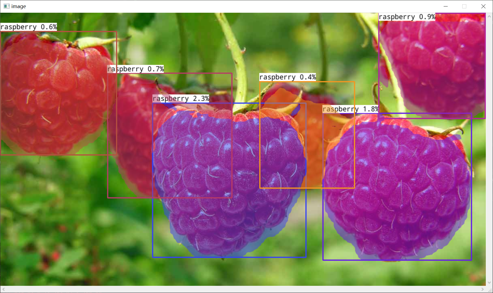
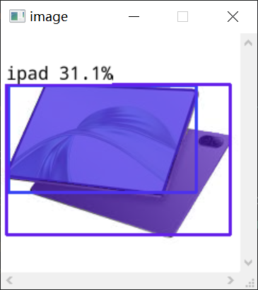

# YoloE On ncnn

算法交流群(QQ): 767178345

## 模型准备

### 下载模型

项目模型已经包含在 models 目录下，其中有

yoloe_11(l/m/s)_seg_pnnx_rebuild.ncnn
为模型主体

yoloe_11(l/m/s)_seg_fuse_model.ncnn
为模态融合模型，对应YOLOE模型中的RepRTA

mobileclip_blt
为CLIP模型，用于生成图像/文本特征（非运行时必须）

该模型的权重过大，请前往：

https://github.com/futz12/ncnn_mobileclip

### 模型转换

您也可以选择手动导出Yolo11SEG模型，使用魔改版本的：

https://github.com/futz12/yoloe

权重依旧与之前兼容。

SAVPE 和 RepRTA 于 Fuse 部分可以使用 export_helper.py 导出

核心YOLO-SEG部分先使用ONNX导出，再使用PNNX转换为PNNX格式，在pnnx.py中参照YOLOv11的导出方法，删除后处理，保证模型的动态输入，同时注入卷积权重即可。

本项目在export/下提供修改好的pnnx文件，同时附带有注释跟着改即可

## 项目使用

本节基于仓库中的 C++ 示例代码（main.cpp、YOLOE.h/.cpp、MobileClip.*、SimpleTokenizer.*）给出一套可直接跑通的使用流程。项目已经支持：
- 统一提示管理（PromptManager）：一个 tag 下面可以有多条“文本特征”和“图片特征”
- 文本提示：同一 tag 支持多条文本（多种表述）
- 图片提示：从外部样例库读取，按标签文件中给出的多个框为同一 tag 采样多条图片原型
- s/m/l 三种 YOLOE 模型
- 每个 tag 的特征上限与 PCA 压缩（超出上限时自动压缩到指定条数）
- 测试配置均在 main.cpp 中以变量形式给出，无需命令行参数

### 1. 环境依赖

- C++17
- CMake ≥ 3.15
- OpenCV 4.x（core、imgproc、highgui）
- ncnn（建议 20240227 及以上）
- 已编译好的 ncnn 静/动态库，确保 `find_package(ncnn)` 或手动链接配置可用

### 2. 目录结构

参考如下目录组织（与 main.cpp/YOLOE.cpp 的路径一致）：

```
project-root/
├─ models/
│  ├─ yoloe_11s_seg/
│  │  ├─ yoloe_11s_seg.ncnn.param
│  │  ├─ yoloe_11s_seg.ncnn.bin
│  │  ├─ yoloe_11s_seg_fuse_head.ncnn.param
│  │  ├─ yoloe_11s_seg_fuse_head.ncnn.bin
│  │  ├─ yoloe_11s_seg_reprta.ncnn.param
│  │  ├─ yoloe_11s_seg_reprta.ncnn.bin
│  │  ├─ yoloe_11s_seg_savpe.ncnn.param
│  │  └─ yoloe_11s_seg_savpe.ncnn.bin
│  ├─ yoloe_11m_seg/   # 同上
│  ├─ yoloe_11l_seg/   # 同上
│  ├─ mobileclip_blt_export/
│  │  ├─ image_encoder.ncnn.param
│  │  ├─ image_encoder.ncnn.bin
│  │  ├─ text_encoder.ncnn.param
│  │  ├─ text_encoder.ncnn.bin
│  │  ├─ projection_layer.ncnn.param
│  │  └─ projection_layer.ncnn.bin
│  ├─ bpe_simple_vocab_16e6.txt        # tokenizer 词表
│  └─ vocab.txt                        # SimpleTokenizer bytes_to_unicode 用
├─ example/
│  ├─ raspberry/
│  │  ├─ labels.txt
│  │  ├─ 1.jpg
│  │  ├─ 2.jpg
│  │  └─ ...
│  ├─ red_panda/
│  │  ├─ labels.txt
│  │  ├─ 1.jpg
│  │  └─ ...
│  └─ watch/
│     ├─ labels.txt
│     ├─ 1.jpg
│     └─ ...
├─ *.cpp                # main.cpp、YOLOE.cpp、MobileClip.cpp、SimpleTokenizer.cpp
├─ *.h                  # YOLOE.h、MobileClip.h、SimpleTokenizer.h
└─ CMakeLists.txt
```

注意：
- main.cpp 中通过 `ModelSize` 选择 s/m/l；代码会自动拼接到 `models/yoloe_11{tok}_seg/` 路径下加载对应的 YOLOE 主干、FUSE(RepRTA)、SAVPE 文件。
- MobileCLIP 的三个子网文件位于 `mobileclip_blt_export/` 目录。
- tokenizer 所需 `bpe_simple_vocab_16e6.txt`、`vocab.txt` 需位于 models 目录。

### 3. 样例库（图片提示）准备

example 目录组织如下：
- `../example/<tag>/labels.txt`
- `../example/<tag>/*.jpg`

其中 labels.txt 每行格式为：
```
xxx.jpg x1 y1 x2 y2 tag1  x1 y1 x2 y2 tag2  ...
```

说明：
- 每一行对应一张图片 xxx.jpg（位于同一目录）
- 后续是若干组 5 元组，每组为一个目标：四个顶点坐标（原图坐标系）+ 文字标签 tag
- 一行可以包含多个不同 tag 的对象
- 例如：
  ```
  0001.jpg 123 345 456 788 person  13 35 46 78 dog
  ```

程序会：
- 读取对应图片
- 将每个框按 YOLO 的 letterbox 几何映射到 P3 尺度（H/8×W/8）生成掩码
- 通过 SAVPE 子网生成每个对象的 512 维图片原型 embedding
- 这些 embedding 会被加入到各自的 tag 下

### 4. 文本提示（一个 tag 多文本）

在 main.cpp 顶部配置 `tag_to_texts`：
```cpp
std::map<std::string, std::vector<std::string>> tag_to_texts = {
  {"person", {"person", "a person", "a human", "a man", "a woman"}},
  {"cat",    {"cat", "a cat", "a kitten"}},
  {"dog",    {"dog", "a dog", "a puppy"}}
};
```

程序会：
- 使用 SimpleTokenizer + MobileCLIP 对每条文本编码得到 1×512 向量
- 可选经过 RepRTA 对齐到 YOLOE 空间
- 把这些特征加入 PromptManager：同一 tag 下可挂多条文本特征

### 5. 运行流程

- 重要变量（main.cpp 顶部）：
    - `model_root`：模型根目录（默认 `../models`）
    - `model_size`：`ModelSize::Small/Medium/Large`（默认 Large）
    - `infer_img_path`：最终推理/可视化的目标图像（默认 `../apple.png`）
    - `example_root`：样例库根目录（默认 `../example`）
    - `example_tags`：要遍历的 tag 子目录列表（默认 `{person, cat, dog}`）
    - `pm.set_max_per_tag(k)`：设置每个 tag 最多保留的特征数（默认 8，超出时启用 PCA 压缩）
    - `yoloe.set_prompts(pm, /*apply_pca=*/true)`：设置为 `true` 时，超出上限使用 PCA 压缩

- 编译与运行（示例）：
本项目自带了依赖，在msvc2022环境下可直接编译运行
```bash
  mkdir -p build && cd build
  cmake .. -DCMAKE_BUILD_TYPE=Release
  make -j
```

- 程序执行做的事：
    1) 加载 YOLOE（s/m/l 自动调路径）、FUSE(RepRTA)、SAVPE、MobileCLIP、Tokenizer
    2) 文本侧：为每个 tag 的多条文本编码 → RepRTA → 放入 PromptManager
    3) 图片侧：遍历 `../example/<tag>/labels.txt`，逐图读取、按行解析多个框与 tag
        - 利用 YOLOE::try_forward 得到该图的 P3/P4/P5
        - 用 YOLOE::make_mask 将原图框映射到 P3 掩码
        - SAVPE.forward 生成每个对象的 512 维图片原型
        - 将每条原型加入对应 tag
    4) set_prompts：对每个 tag 的全部特征做“截断或 PCA 压缩到上限”，并跑 FUSE 得到动态分类头权重
    5) 对 `infer_img_path` 推理，绘制分割结果与标签（每条特征对应一个类名=tag）

### 6. 自定义与裁剪

- 只用文本提示：可将 `example_tags` 清空或跳过图片侧循环
- 只用图片提示：可将 `tag_to_texts` 置空或不添加文本特征
- 控制每个 tag 的最大特征数：`pm.set_max_per_tag(k)`
- 关闭 PCA：将 `yoloe.set_prompts(pm, /*apply_pca=*/false)`
- 模型尺寸切换：改 `model_size = ModelSize::Small/Medium/Large`
- 若不同导出版本导致 P3/P4/P5 节点名变化，可在 YOLOE.cpp 中调整：
  ```cpp
  // Large_P_Layer / Medium_P_Layer / Small_P_Layer
  // p_layers_ = {P3, P4, P5};
  ```

### 7. 常见问题

- “try_forward: P3/P4/P5 layer names not configured”：请确认 YOLOE.cpp 中 S/M/L 的 P3/P4/P5 节点名与你的导出一致
- “Failed to load model ...”：检查模型路径与命名是否与第 2 节一致
- “Tokenize failed …”：检查 `models/bpe_simple_vocab_16e6.txt`、`models/vocab.txt` 是否存在
- 预测结果类别文本：程序中每条特征会映射到其 tag 名字，UI 上显示即为 tag

如需命令行方式控制，可自行将 main.cpp 顶部的配置变量改为解析 argv；当前示例按“直接改变量编译运行”的方式提供。

## 效果演示

### 视觉提示


### 文本提示


### 整体效果
YoloE 的 score很迷，需要制定合适自己场景的规则才好使用
